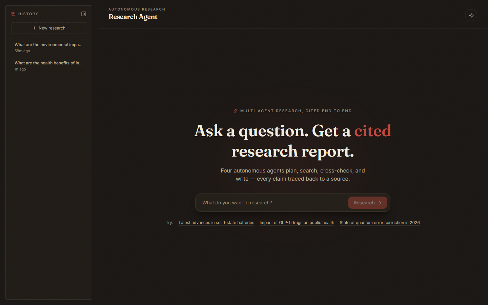
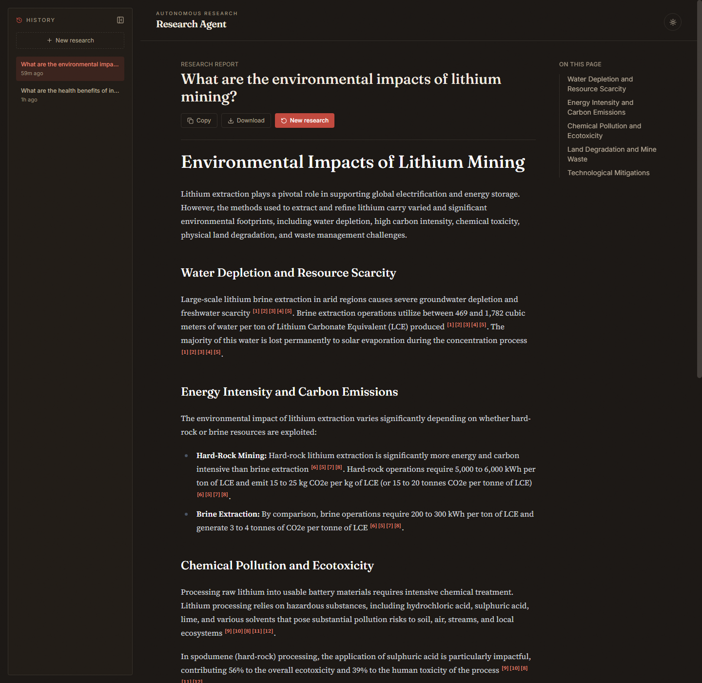
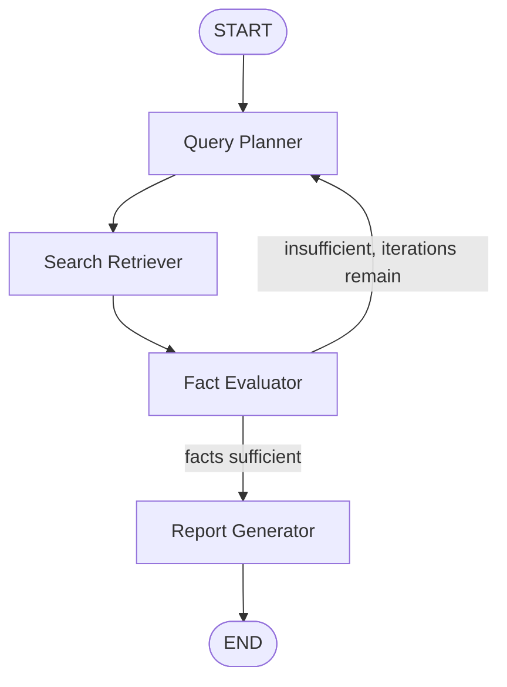

# AI Research Agent System

An autonomous, multi-agent research workflow built on **LangGraph**. Given a
topic, it decomposes the query, searches the live web across multiple
sub-queries, cross-references and validates what it finds, and synthesizes a
structured markdown report where every verifiable claim carries a strict
inline citation back to its source — available as a CLI or through a live,
animated web UI that shows the four agents working in real time.

> Project Lead: Mubashir Shabir Memon · Roll No: 25SP-031-AI · Department: BSAI




## How it works

The system is a directed state graph with four agent nodes and one
conditional loop, so low-quality or incomplete research automatically
triggers another round of planning instead of silently producing a thin
report.



| Node | Responsibility |
|---|---|
| **Query Planner** (`planner_node`) | Breaks the topic into 3-5 targeted search queries. On a loop-back, it generates new queries aimed only at the gaps the evaluator flagged. |
| **Search Retriever** (`retriever_node`) | Runs each new sub-query against the Tavily search API and records raw snippets alongside their source URL. |
| **Fact Evaluator** (`evaluator_node`) | Cross-references snippets, drops duplicates, resolves conflicting claims, and decides whether coverage is sufficient. |
| **Report Generator** (`generator_node`) | Drafts the final markdown report, ensuring every claim ends with a `[n]` citation, and appends a verified References section built in code (not by the LLM) for accuracy. |

The loop is capped by `MAX_PLANNER_ITERATIONS` (default 2) so the graph always
terminates even if the evaluator is never fully satisfied.

### State

The state object threaded through every node (see [`src/state.py`](src/state.py)):

- `user_query` - the original topic
- `sub_queries` / `searched_queries` - decomposed and already-searched queries
- `collected_data` - raw snippets with `url`, `title`, `sub_query`
- `evaluated_facts` - validated statements with their `source_urls`
- `final_report` - the finished, cited markdown report

## Tech stack

- **Python 3.10+**
- **LangGraph + LangChain** for the stateful multi-agent workflow
- **Google Gemini** (`gemini-3.6-flash` by default, swappable to `gemini-3.6-pro`) via `langchain-google-genai`
- **Tavily API** for agent-optimized web retrieval
- **FastAPI** backend streaming live node-by-node progress to the browser
- **React + TypeScript + Tailwind CSS** (Vite) for the web UI, with Framer Motion and `react-markdown`
- Visual identity: an editorial/academic-journal look (warm charcoal/paper palette, oxblood accent, Fraunces + Source Serif 4 for reading, real superscript footnote citations) rather than a generic dark-SaaS theme — the product's output is a long-form cited report, so the UI is designed to make reading it feel like a considered publication
- **Rich** for CLI output, **pytest** for tests

## Setup

```bash
python -m venv venv
venv\Scripts\activate
pip install -r requirements.txt
copy .env.example .env
```

Then edit `.env` and add:
- `GOOGLE_API_KEY` - from [Google AI Studio](https://aistudio.google.com/app/apikey) (free tier available)
- `TAVILY_API_KEY` - from [Tavily](https://app.tavily.com) (free tier available)

> Gemini's free tier is rate-limited (a handful of requests per minute). Each
> research run makes several LLM calls (planner, evaluator, generator, and
> more on a loop-back), so back-to-back runs can hit `429 RESOURCE_EXHAUSTED`
> — the UI surfaces this as a plain-language error banner; just wait a bit
> and retry.

## Usage

### CLI

```bash
python main.py "What is the current state of solid-state battery research?"
```

The report prints to the terminal and is saved as markdown under `reports/`.
Optional flag:

```bash
python main.py "your topic" --output custom_folder
```

### Web UI

Install the frontend dependencies once:

```bash
cd frontend
npm install
```

**Development** (hot-reloading frontend + auto-reloading backend, two terminals):

```bash
uvicorn api.main:app --reload --port 8000
```
```bash
cd frontend && npm run dev
```

Open the URL Vite prints (usually http://localhost:5173).

**Single-process demo** (one command, no hot-reload):

```bash
cd frontend && npm run build && cd ..
uvicorn api.main:app --port 8000
```

Open http://localhost:8000 — FastAPI serves the built frontend directly.

The web UI shows the four agents running live (including a "Round 2" replay
if the evaluator loops back for more research), then renders the finished
report with clickable citation pills that jump to the References list. Past
reports are listed in the History sidebar.

## Project structure

```
├── main.py                  # CLI entry point
├── src/
│   ├── state.py              # ResearchState TypedDict (shared graph state)
│   ├── config.py              # env config + Gemini client factory
│   ├── graph.py                # StateGraph assembly + conditional routing
│   ├── service.py               # build_initial_state/save_report, shared by CLI + API
│   ├── utils.py                 # slugify, citation-number extraction, logging
│   ├── nodes/
│   │   ├── planner.py            # Node 1: Query Planner
│   │   ├── retriever.py           # Node 2: Search Retriever
│   │   ├── evaluator.py            # Node 3: Fact Evaluator
│   │   └── generator.py             # Node 4: Report Generator
│   └── tools/
│       └── search.py                # Tavily client wrapper
├── api/
│   └── main.py                # FastAPI app: streams graph progress as NDJSON, serves report history
├── frontend/                  # React + TypeScript + Tailwind web UI (Vite)
│   └── src/
│       ├── App.tsx             # view routing: Hero / PipelineView / ReportView
│       ├── api.ts               # fetch + NDJSON stream parsing
│       ├── hooks/useResearchStream.ts
│       └── components/          # Hero, PipelineView, StageCard, ReportView, Sidebar, ThemeToggle
├── tests/                    # pytest unit + API tests (no API keys required)
└── reports/                  # generated markdown reports (git-ignored)
```

## Testing

```bash
pytest
```

Unit and API tests cover pure logic (slugify, citation extraction, conditional
routing) and the FastAPI report-history endpoints (including path-traversal
rejection), all without needing live API keys.

## Possible extensions

- Persist state with a LangGraph checkpointer to support pause/resume or a multi-turn chat interface
- Add a source-credibility scoring step before the evaluator to down-weight low-quality domains
- Parallelize `retriever_node` searches with `asyncio` for lower latency on wide topics
- Add user accounts so report history is per-user instead of shared on disk

## License

MIT - see [LICENSE](LICENSE).
